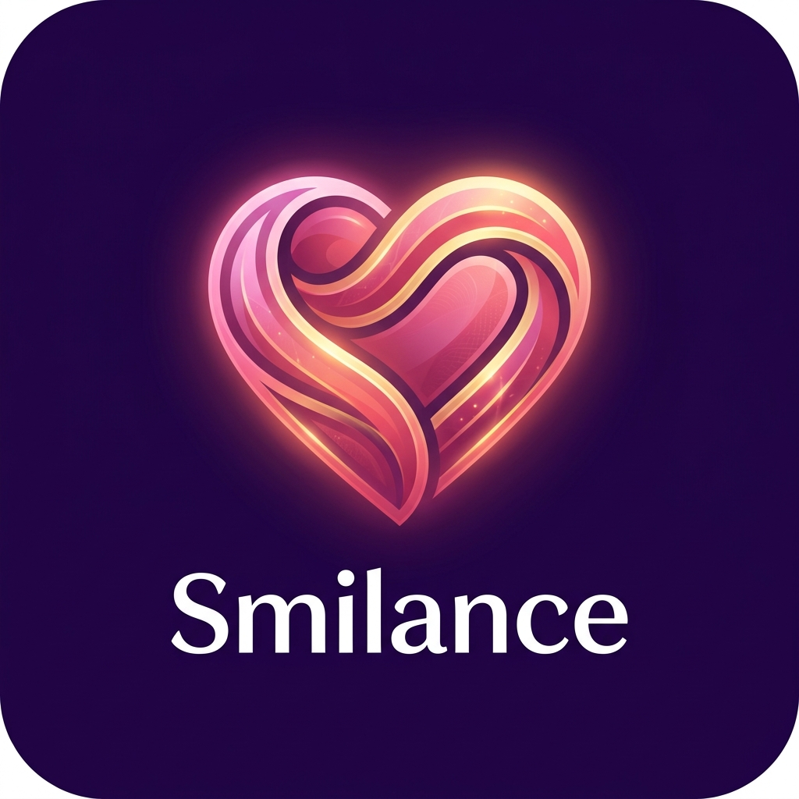

# 🌸 Smilance 

<p align="center">
  
</p>

> A deeply personalized, offline-first sanctuary crafted with precision. Features period tracking, an immersive music lounge, and an encrypted diary—all styled with high-fidelity animations and fluid interactions.

---

## ✨ Exquisite Visuals & Fluid Interactions

Smilance focuses on sensory delight through cohesive colors and refined physics:
- **Liquid Physics Engine:** The Cycle tracker features a deeply immersive, smooth liquid beaker that sloshes vividly to reflect current cycle phases.
- **Particle System:** Elegant interactive particles, bubble floaters, star-bursts, and pulsing feedback across the interface. 
- **Touch Harmonics:** Screen interactions are met with delicate chime sounds and visually striking cluster bursts.
- **Themes:** Handcrafted aesthetic palettes spanning from **Dark Rose** to **Ocean Sapphire**.

---

## 🧭 Complete Feature Walkthrough

### 1. 🏠 Home: The Wish Hearth
* **Animated Ambient Clock:** Real-time UTC ticking with heart-beat separators.
* **Touch My Heart:** An interactive centerpiece reacting to touch with sonic feedback and scattered stars to reveal romantic wish cards.

### 2. 📻 Radio: The Soundscape Portal
* **Lo-Fi Player:** Integrated media controls, playback scrubbing, and dynamic disc-spinning vinyls.

### 3. 📅 Cycle Tracker: Dyn-Fluid Analytics
* **Liquid Phase Beaker:** Real-time reactive water animations for cycle progression.
* **Smart Analytics Hub:** Heatmaps, symptom scatter-plots, and historic logs tracking ovulation windows across 4 active months. 

### 4. 🔔 Intelligent PWA Push Diagnostics
* Full Offline caching support built with Service Workers.
* Diagnostic tracking tools to guarantee background push deliveries and test handshake authorizations.

### 5. 📝 Journey: The IndexedDB Vault
* **Secret Diary & Letters:** Heavy client-side storage architecture guarding deeply personal notes intact natively.

### 6. 🔐 Zero-Trust Security
* **App Passcode Lock:** Bank-grade visual lock-screens. 
* ***Default Startup PIN:*** `0809`
* **Deep Clean:** End-to-end data wipe utilities securely trapped behind authentication gates.

### 7. 👑 Admin Push Notification Console
* **Secret URL:** `https://r2dapps.github.io/SmilanceWithKanna/admin.html` (Local: `http://localhost:3000/admin.html`)
* **Instant Custom Surprises:** Compose and queue custom push notifications directly to Kanna's phone.
* **1-Click Presets:** Birthday countdown teasers, romantic whispers, water reminders, and secret surprise alerts.
* **Direct Terminal Dispatch:** `npx tsx send-push.ts`

---

## 🚀 Deployment: Hosting on GitHub Pages

Smilance is developed as a standalone React SPA (Single Page Application), making it **100% compatible with GitHub Pages** for free, secure hosting. 

### Effortless GitHub Pages Setup:

1. **Update `vite.config.ts`:**
   Add `base: '/smilance/'` (replace `smilance` with your actual GitHub repository name).
2. **Install Deployment Tool:**
   ```bash
   npm install -D gh-pages
   ```
3. **Add Deploy Scripts (`package.json`):**
   ```json
   "scripts": {
     "predeploy": "npm run build",
     "deploy": "gh-pages -d dist"
   }
   ```
4. **Deploy:**
   Run `npm run deploy`. Your beautiful app is now hosted globally!

---

## 🎨 Personalization & Content Customization Map

Here is the quick guide to all files where you can customize messages, dates, music, and secrets:

| Feature / Content | Exact File Location | Details |
|---|---|---|
| **Annual Special Dates & Seasons** | [`src/App.tsx`](file:///d:/ReactApps2Git/SmilanceWithKanna/src/App.tsx#L44-L57) & [`src/components/FloatingGiftBox.tsx`](file:///d:/ReactApps2Git/SmilanceWithKanna/src/components/FloatingGiftBox.tsx#L17-L34) | Modify `SPECIAL_DATE_THEMES` (`'09-07': 'birthday'`) and `isBirthdaySeason()` to change or add anniversary/birthday dates. |
| **80+ Romantic Birthday Countdown Quotes** | [`src/components/FloatingGiftBox.tsx`](file:///d:/ReactApps2Git/SmilanceWithKanna/src/components/FloatingGiftBox.tsx#L36-L125) | Edit the `ADVANCE_BIRTHDAY_QUOTES` array to customize the love whispers randomized every time she opens the gift box. |
| **Daily Home Quotes & Romantic Wishes** | [`src/data.ts`](file:///d:/ReactApps2Git/SmilanceWithKanna/src/data.ts) | Edit `DAILY_QUOTES` for the daily rotating wishes revealed by tapping the "Touch My Heart" button. |
| **Splash Screen Greetings & Spinner** | [`src/App.tsx`](file:///d:/ReactApps2Git/SmilanceWithKanna/src/App.tsx#L521-L570) | Customize the startup greeting, birthday edition subtitle, and loading spinner animation inside `if (isAppLoading)`. |
| **Music Lounge & Audio Tracks** | [`src/musicData.ts`](file:///d:/ReactApps2Git/SmilanceWithKanna/src/musicData.ts) & [`public/music/`](file:///d:/ReactApps2Git/SmilanceWithKanna/public/music/) | Place audio `.mp3` files in `public/music/` and register their title & artist in `src/musicData.ts`. |
| **App Passcode / Security PIN** | [`src/App.tsx`](file:///d:/ReactApps2Git/SmilanceWithKanna/src/App.tsx#L595) & Settings UI | Default PIN is `0809`. Can be updated by the user in Settings or altered in code. |
| **Live Push Notification Sender** | [`public/admin.html`](file:///d:/ReactApps2Git/SmilanceWithKanna/public/admin.html) & [`send-push.ts`](file:///d:/ReactApps2Git/SmilanceWithKanna/send-push.ts) | Secret console to dispatch instant custom push messages and 1-tap birthday countdown alerts. |

---

## 🛠 Developer Quick-Start

Smilance leverages **React 18**, **TypeScript**, and **Tailwind CSS**, energized by **Vite**.

1. **Install Dependencies:** `npm install`
2. **Run Dev Environment:** `npm run dev` (Runs on `localhost:3000` / `localhost:3001`)
3. **Build Static Bundle:** `npm run build`

---
*Crafted elegantly with pristine code. Everything runs smoothly, beautifully, and safely.* 💖
